# 🎟️ Microservices-Based Online Event Booking Platform  

## 📌 Overview  
This project is a **fully functional microservices-based event booking system**. It allows users to register, browse events, make bookings, and receive notifications. The system is built with **Node.js, Express, MongoDB/PostgreSQL, RabbitMQ, and Docker** and follows an **event-driven architecture**.

## 🏗️ Architecture  
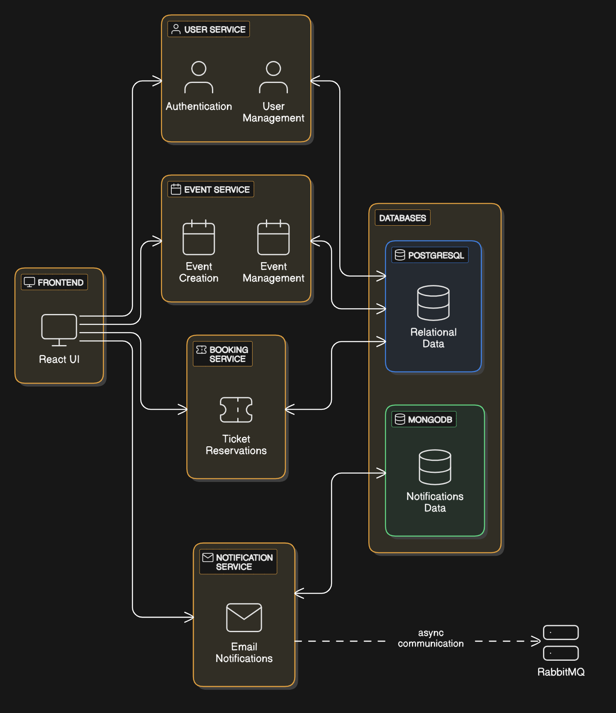  

The platform consists of four microservices:
- **User Service** → Handles user authentication & management  
- **Event Service** → Manages events & their availability  
- **Booking Service** → Handles event booking & payment  
- **Notification Service** → Sends emails & notifications  

## 🚀 Features  
✔️ **User authentication with JWT**  
✔️ **Event management** (CRUD operations)  
✔️ **Booking system** (ticket reservations)  
✔️ **Email notifications via RabbitMQ**  
✔️ **Microservices communication using REST & Message Queues**  

## 🛠️ Tech Stack  
- **Backend:** Node.js, Express, Sequelize/Mongoose  
- **Database:** PostgreSQL (User, Booking, Event) & MongoDB (Notifications)  
- **Messaging Queue:** RabbitMQ  
- **Authentication:** JWT  
- **API Documentation:** Swagger/OpenAPI  

## 📂 Folder Structure  
│── /event-service # Event Management Service
    │── /models # Database setup and Schema
    │── /Routes # Endpoints
    │── Index.js # Server
    (**NOTE:** Above structure remains consistent for each service)
│── /booking-service # Booking & Reservations
│── /notification-service # Email & Notifications
|── /user-service # User Registration 
    │──/user-frontend # UI
│── README.md # Project documentation

## 📜 API Endpoints for Event Booking Platform

### **🔹 User Service (`/users`)**  
| Method | Endpoint | Description |
|--------|----------|-------------|
| `POST` | `/users/signup` | Register a new user |
| `POST` | `/users/login` | Login & get JWT token |
| `GET`  | `/users/:id` | Get user by ID |

---

### **🔹 Event Service (`/events`)**  
| Method | Endpoint | Description |
|--------|----------|-------------|
| `POST` | `/events` | Create a new event |
| `GET`  | `/events` | Get all events |
| `GET`  | `/events/:id` | Get event details by ID |
| `PUT`  | `/events/:id` | Update event details |
| `DELETE` | `/events/:id` | Delete an event |

---

### **🔹 Booking Service (`/bookings`)**  
| Method | Endpoint | Description |
|--------|----------|-------------|
| `POST` | `/bookings` | Create a booking |
| `GET`  | `/bookings` | Get all bookings |
| `GET`  | `/bookings/:id` | Get booking details by ID |
| `DELETE`  | `/bookings/:id` | Cancel a booking |
| `PUT`  | `/bookings/:id` | Update booking details |

---

### **🔹 Notification Service (`/notifications`)**  
| Method | Endpoint | Description |
|--------|----------|-------------|
| `POST` | `/notifications` | Send notifications |

---

## 📸 Screenshots

### ✅ Jira Board Integration
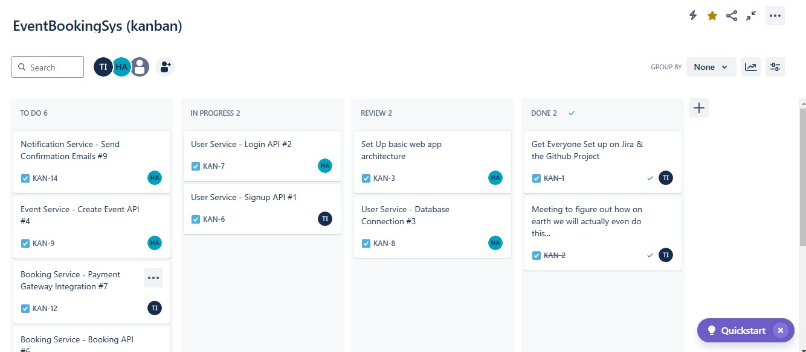
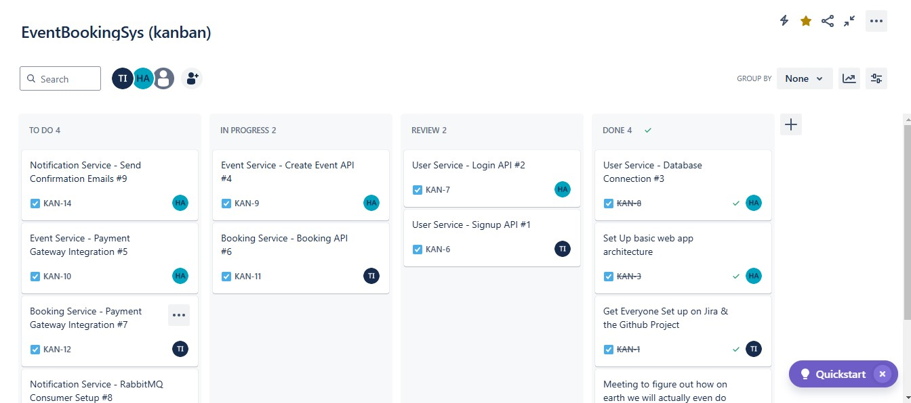
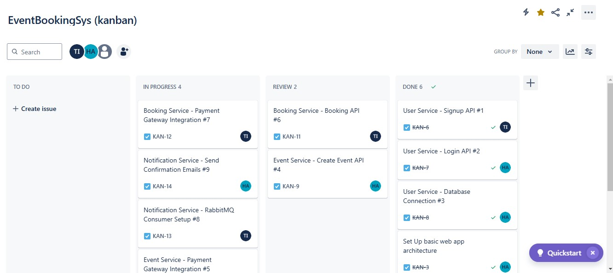
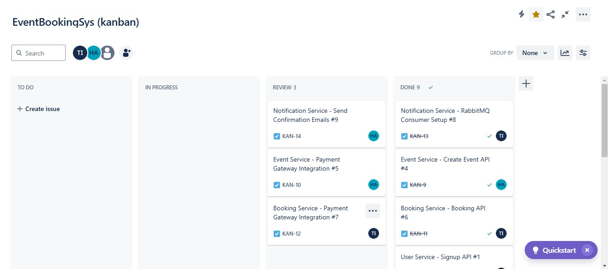

### ✅ GitHub Integration
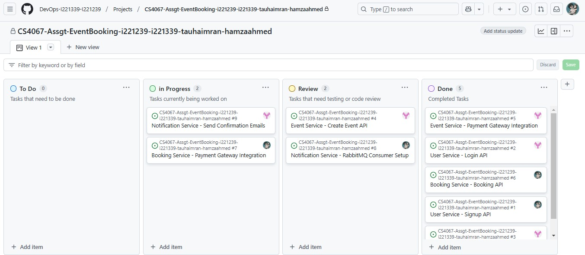
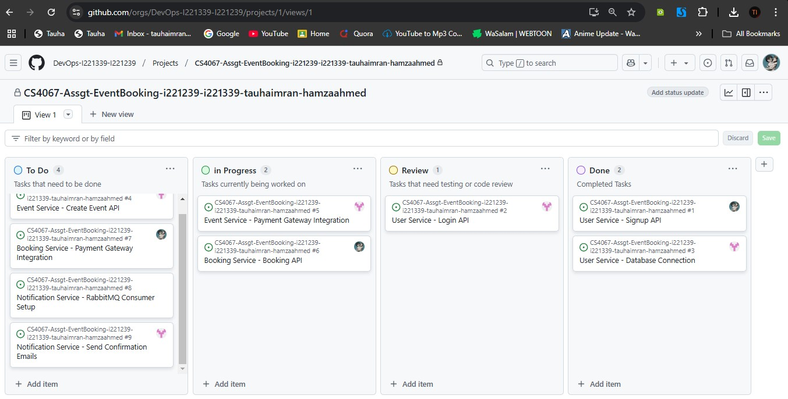
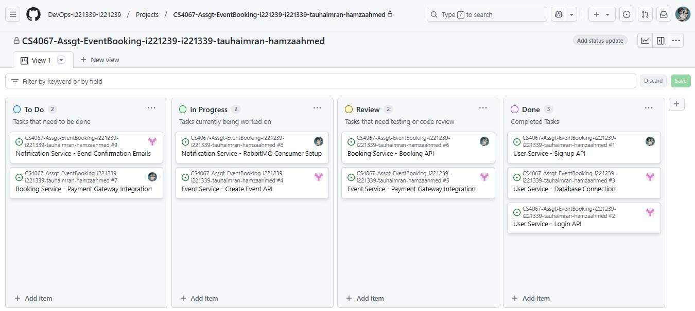
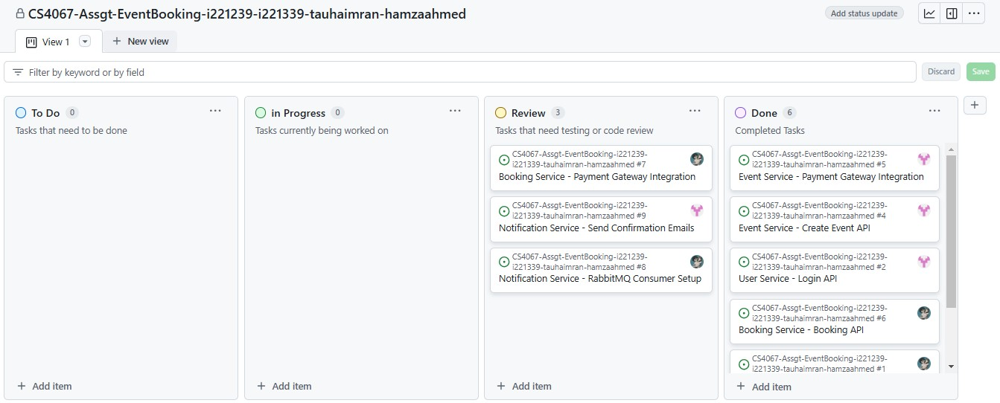

### ✅ Jira-Github Integration
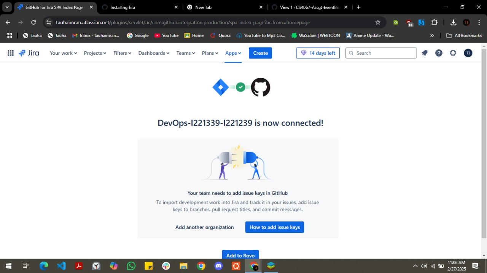
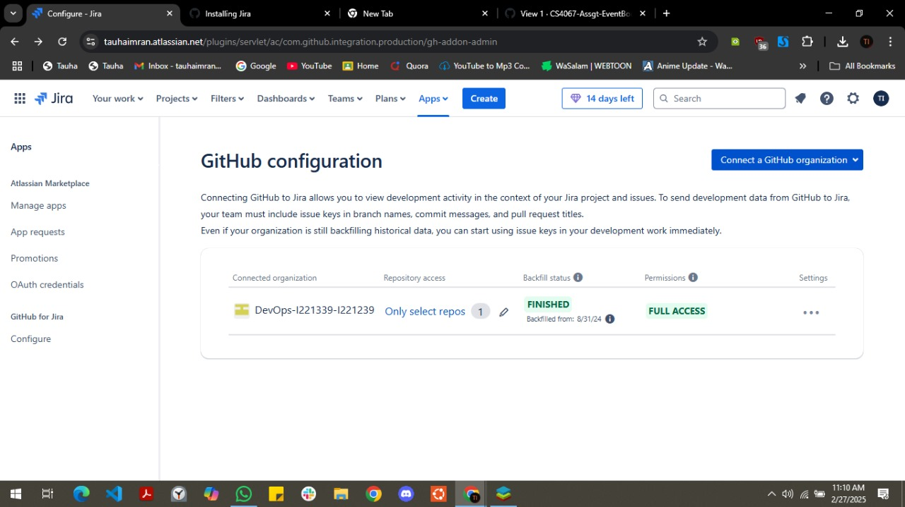
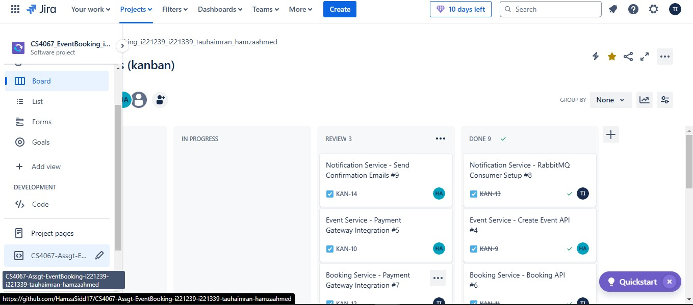

